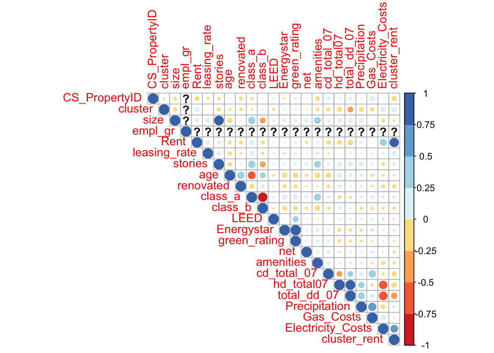
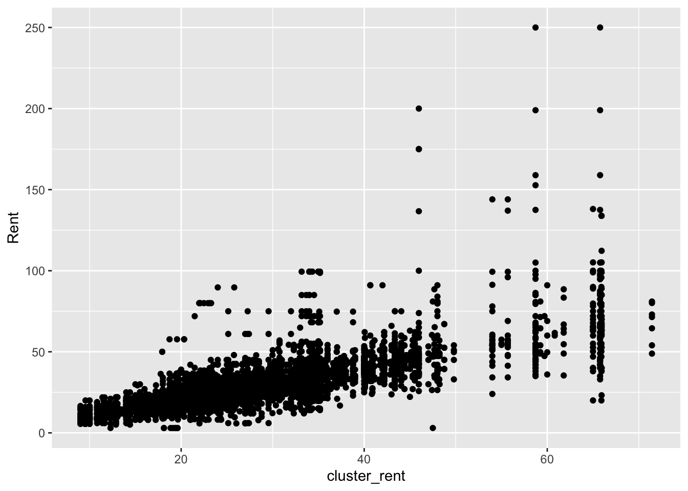
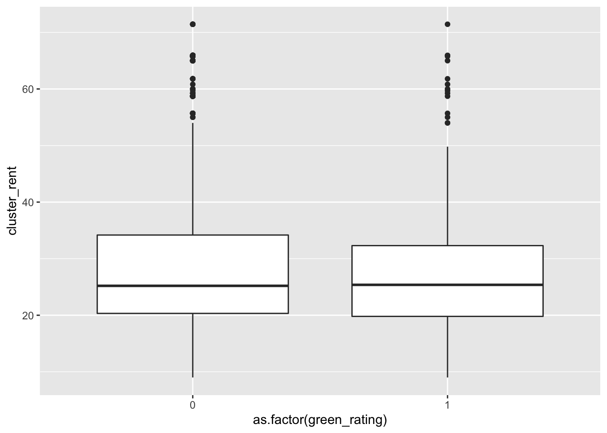
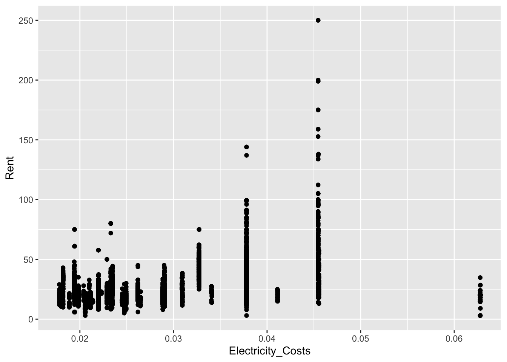
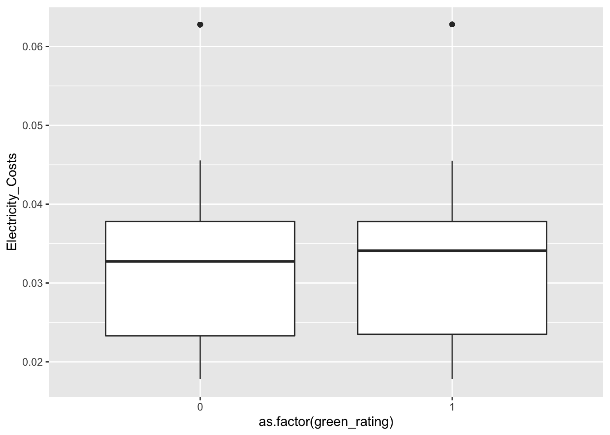

```r
library(tidyverse)
```

```
## ── Attaching packages ─────────────────────────────────────── tidyverse 1.3.1 ──
```

```
## ✓ ggplot2 3.3.5     ✓ purrr   0.3.4
## ✓ tibble  3.1.2     ✓ dplyr   1.0.7
## ✓ tidyr   1.1.3     ✓ stringr 1.4.0
## ✓ readr   1.4.0     ✓ forcats 0.5.1
```

```
## ── Conflicts ────────────────────────────────────────── tidyverse_conflicts() ──
## x dplyr::filter() masks stats::filter()
## x dplyr::lag()    masks stats::lag()
```

```r
library(corrplot)
```

```
## corrplot 0.90 loaded
```

```r
library(RColorBrewer)
```


```r
green = read_csv("greenbuildings.csv")
```

```
## 
## ── Column specification ────────────────────────────────────────────────────────
## cols(
##   .default = col_double()
## )
## ℹ Use `spec()` for the full column specifications.
```

```r
green_occ = green %>% filter(leasing_rate > 10)


green_sqft = green_occ %>% filter(green_rating == 1) %>% summarise(rentsqft = mean(Rent))
green_sqft = green_sqft[[1, 1]]
cat('green rent per sqft is', green_sqft)
```

```
## green rent per sqft is 30.02848
```

```r
non_green_sqft = green_occ %>% filter(green_rating == 0) %>% summarise(rentsqft = mean(Rent))
non_green_sqft = non_green_sqft[[1, 1]]
cat('\nnon green rent per sqft is', non_green_sqft)
```

```
## 
## non green rent per sqft is 28.44478
```

```r
sqfts = data.frame(c(green_sqft, non_green_sqft))
```
The intern says that green buildings cost 27.60 per sqft when the actual cost is 30.03 so there is a 2.43 dollar discrepancy. The intern also says non green buildings cost 25 per sqft when they actually cost 28.58 so there is a 3.58 discrepancy.


```r
cat('the actual difference for the building if it were green is this dollar amount: \n')
```

```
## the actual difference for the building if it were green is this dollar amount:
```

```r
250000*(green_sqft-non_green_sqft)
```

```
## [1] 395925.1
```
That is $288337 less than predicted.

If costs of the building are an extra 5 million to make it green it would actually take this many years to pay off the extra building costs:

```r
5000000/361663
```

```
## [1] 13.82502
```
Which is over 6 years longer than the analyst projected. 
After almost 14 years you would then be making $361663 a year extra over having a green building.


```r
# corrplot(c)

corrplot(cor(green_occ), col=brewer.pal(n=8, name="RdYlBu"), type = "upper")
```


cluster rent (the buildings location) has a high impact on Rent
electricity cost has high impact on rent


```r
ggplot(data = green_occ, aes(x = cluster_rent, y = Rent)) + geom_point()
```



```r
ggplot(data = green_occ, aes(x = as.factor(green_rating), y = cluster_rent)) + geom_boxplot()
```


As you increase cluster, rent increases. cluster does not impact green rating. 


```r
ggplot(data = green_occ, aes(x = Electricity_Costs, y = Rent)) + geom_point()
```



```r
ggplot(data = green_occ, aes(x = as.factor(green_rating), y = Electricity_Costs)) + geom_boxplot()
```




